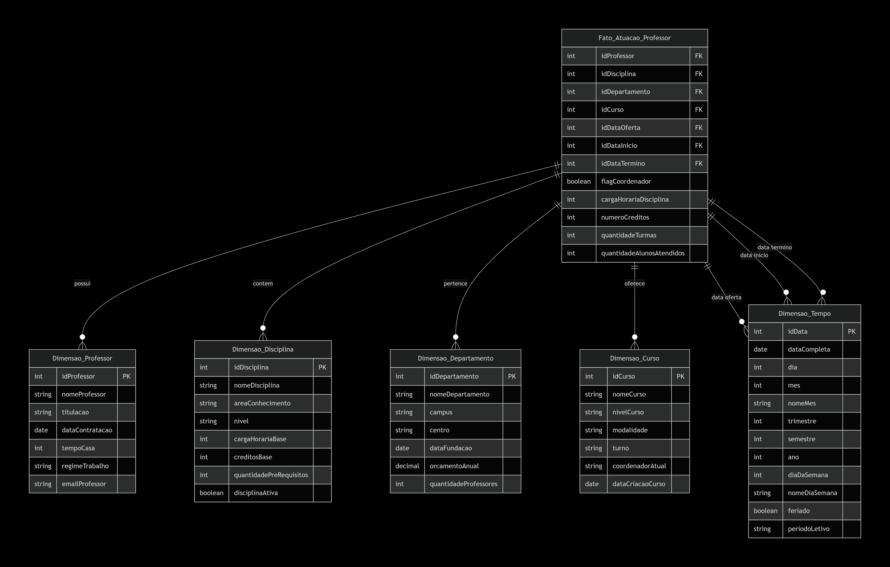

# Dimensional Model – Star Schema for Faculty Analysis

## Overview

This repository contains a dimensional modeling project (Star Schema) developed from a relational university database, focusing on faculty data analysis. The model was designed to support Business Intelligence (BI) insights and strategic decision-making related to the teaching staff.

## Model Objective

Enable multidimensional analysis of faculty members, their involvement in courses, departments, and programs over time, providing insights such as:
- Teaching workload per academic term  
- Distribution of faculty across departments and schools  
- History of department coordination roles  
- Course offerings by program  
- Evolution of faculty engagement  

## Model Structure

### Fact Table

**Fact_FacultyActivity**: Records faculty participation in offered courses, with granularity by course, faculty member, program, and academic term.

### Dimension Tables

1. **Faculty Dimension**: Personal and professional details of faculty members  
2. **Course Dimension**: Information about courses taught  
3. **Department Dimension**: Academic department data  
4. **Program Dimension**: Characteristics of offered programs  
5. **Time Dimension**: Supports temporal analysis with multiple granularities  

## Modeling Decisions

- **Granularity**: Course offering by faculty member in a specific academic term  
- **Multiple time dimensions**: For analyzing offering, start, and end dates  
- **Additional metrics**: Includes indicators such as coordination flag and student count served  
- **SCD Type 2**: Recommended for the Faculty Dimension to track historical changes  

## Possible Analyses

- "Which faculty members had the highest teaching load last semester?"  
- "How has the number of courses per department evolved over the past 5 years?"  
- "Which faculty members served as coordinators, and during which periods?"  
- "What is the distribution of courses by level (undergraduate vs. graduate) per faculty member?"  

## How to Use

1. **ETL**: Develop extraction, transformation, and loading processes from the relational model to the dimensional model  
2. **BI Tools**: Connect BI tools such as Power BI, Tableau, or Metabase to the dimensional layer  
3. **OLAP Cubes**: Build multidimensional cubes for advanced analysis  

## Notes

- Student data was intentionally excluded as per specification  
- The Time Dimension was artificially created to compensate for missing temporal data in the original model  
- Surrogate keys are recommended for all dimensions  

## Next Steps

1. Validate the model with business stakeholders  
2. Define incremental loading strategy  
3. Develop priority dashboards  
4. Document key performance indicators (KPIs)  

## Diagram

